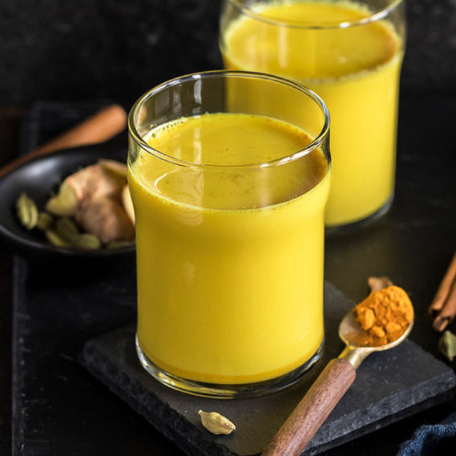
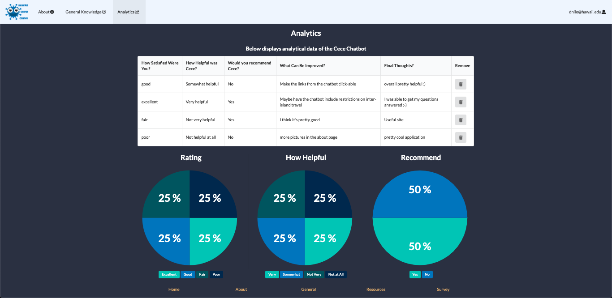
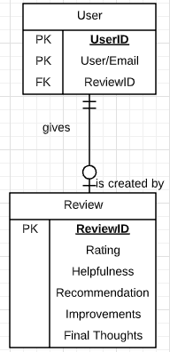

Now when you think of design patterns, I'm pretty sure you guys are literally thinking a specific design that could easily be an implement to your coding assignment.  Well my friend, let me tell you that you are wrong as it is way more than just putting in some lines of code to make it aesthetically pleasing to the user!  A design pattern is a type of solution that could be repurposed/reimplemented in software design applications.  With object orientation, the pattern will display how the classes/objects interact each other without specifying the classes/objects in the final application.  There are tons of design patterns utilized in software design, but there are four commonly used patterns: Factory, Singleton, Observer, and MVC.  With every single adjustment to a design pattern, you would essentially

***"Spice a dish with love and it pleases every palate." -Plautus***

## Spice Upon Spice, Flavor Upon Flavor

Being in this software engineering class taught by Professor Philip Johnson has been eye-opening to me and when I was watching his screencasts about design patterns, I immediately thought of my craze with Indian cuisine as, for some people, is known to have a various amount of spices harmoniously building up levels of flavor.  Ever since the start of this semester, one item which I have been making for myself is a drink called [haldi doodh](https://www.cookwithmanali.com/golden-milk-masala-haldi-doodh/) (also called golden milk).  For those who are interested, the base of this drink consists of milk and turmeric.  After that, you put in a selection of spices such as cardamom and ginger and let it all simmer to get a warmly spiced drink.  When I recently made it this evening, I realized it is similar to a Singleton design pattern because with the spices I have access to in my kitchen, I created a drink where I taste the spices I have simmered and steeped inside my drink.

## Milk and Coding

Speaking of Singleton design patterns, I also realized the final project my group and I are developing, [Hawaii Covid Convo](https://hi-covid-convo.github.io), also implements a Singleton design pattern since the user gives a review they have to fill out, which will eventually be displayed in the Analytics page along with an array of reviews created by other various users.

The design template my group and I used for our application started out with the [Meteor React Application Template](https://ics-software-engineering.github.io/meteor-application-template-react/) provided by Professor Johnson as a way for us as well as the other sections to see how many applications we can develop within a fundamental design pattern.  To me, I found this similar to combinations of spices one can use to make golden milk/haldi doodh.  Overall, if you are struggling to comprehend a concept or find ways to flavor up a design pattern, visualize it in your head and eventually you can nama-slay whatever design pattern you have to handle.
 
