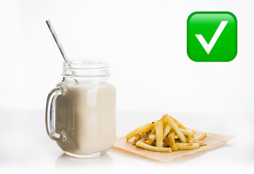
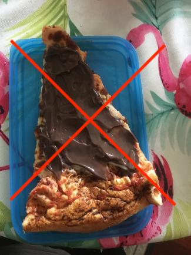

## Gaining Lessons (And Hopefully Not Weight)

Have you ever had scrumptious, five star-worthy food at a restaurant?  Starting with an appetizer you enjoyed so much to the point where you eventually get infatuated by it, slowing down on a mouthwatering main course to savor those last morsels, and ending on a decadent dessert to the point you cannot stop thinking about it.  Not only does it make you want to go back to the restaurant an endless amount of times, but it also educates your palate in a way you plan to replicate those dishes with nearly perfect execution.  That is exactly how I am feeling during these few bites of software engineering as it comes to an end, which I do not want to happen at all.  And I hopefully will not let it end since I enjoyed it!

When I registered for this class, I genuinely had no idea what I was learning during these harsh times courtesy of the COVID pandemic.  However, as the semester progressed, it started to grow on me just like how a person can have an anathema with stinky cheese, but eventually like it.  From the ever so (formerly) daunting Thursday WODs to the intense group final project, you can say I had an exhilarating trip to Software Engineering Flavortown.  For the trip of a lifetime, I am giving you a tour on some of my favorite topics we have discussed.

## Keeping it Simple with Functional Programming

Some of us, especially for the foodies, have those moments when we are given only a few ingredients and they have absolutely no idea what to do with them.  That was my relationship with Functional Programming because I initially had a difficult time understanding the topic.  However, when I took a couple of glances at the [Underscore Library](http://underscorejs.org/), it dawned on me how it is similar to making pasta or utilizing vegetables and its scraps to condense into a broth.  They both correlate with Functional Programming as they require minimal ingredients, yet they produce simplistically flavorful food that would please customers.  Morally, just because you are given simple ingredients, does not necessarily mean you have to make boring food.  You sometimes just have to follow the KISS principle (Keep It SImple, Stupid) without any built-in objects.  Now I must say I have not fully comprehended this topic yet, but with a few ingredients, I can confidently implement Functional Programming whenever I have to dabble with software engineering.

## Coding Standards and Food

When it comes to Coding Standards, ESLint is a practical tool for aspiring software engineers in order to save them some time from making mistakes they may be unaware of such as ignoring semicolons and misspelling certain code attributes.  In a culinary perspective, we definitely are chefs in some ways as we experiment unconventional food combinations (Ex: Cheddar cheese/apple pie and dipping French fries in a milkshake) that turn out to be tastier than we thought to the point where they receive green checkmarks.  However, there are other wacky food combinations such as dipping Oreos into orange juice or topping your cheese pizza with chocolate pudding (both of which I actually enjoy) where others consider them as either warnings or red X's.  With trial and error, I know you can set these coding standards for yourself in order to get the satisfying checkmark.  For ongoing semesters and possibly outside UH Manoa, I will utilize ESLint and Coding Standards as a way for me to become a properly seasoned software engineering candidate.

## Properly Seasoned UI Frameworks

Now on to my favorite ingredient, User Interface Frameworks!  So if you referred to a [previous essay](https://duhkneelow.github.io/essays/semantic-ui.html) of mine, it should not be a surprise to you on how much I enjoyed this topic the most and it reflected on my work ethic as I was thrilled to learn every single exercise/WOD.  When I dabbled on my choice of website to recreate, I thought we were supposed to replicate every component until I found out we did not have to.  At first, I thought I did way too much for the first Semantic UI assignment, but I still believe it was necessary for me to learn it in this challenging approach since I gained a better understanding for the elements, collections, and views provided.  Referring to the [article](https://semantic-ui.com/kitchen-sink.html) as well as the Meteor and React assignments, it made me realize how each element, collection, and view can correlate with a seasoning/spice/herb as they are the flavorful fundamentals of making tasty food.  I would wholeheartedly recommend incorporating User Interface Frameworks as I find it a powerful ingredient for any software engineer.

## Already Full?

It may look like I have a lot of topics on my plate, but I most certainly have a lot more room in my brain to develop my software engineering skills.  Just because the tour is over, does not mean it is over since we will encounter these topics again someday.  Learning these topics over the semester makes me not only truly appreciate the beauty of software engineering, but also computer science in general.  However, I do believe I still have some work to do with a few topics since I know I have to season on some areas before I get my just desserts.  When I work on them, it would be like a cherry (or a bunch of cherries) on top of an indulging cake.  Overall, I cannot wait to see where these skills lead me as time goes by!
 
