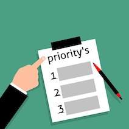
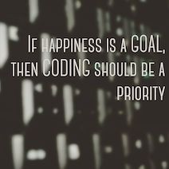

Refreshing on a programming language you have familiarized in the past can either be a walk in the park or an uphill battle.  Regardless of the time gap, it is exhilarating to strengthen your skills or challenge yourself to know what you are capable of.  Within that short span of time, I definitely reflected on how to improve myself with JavaScript in order to develop my software engineering skills.

## Prioritize
Make sure to give yourself some time to study JavaScript and soak up as much information as you can to prepare yourself for the unknown.  However, do NOT do it all in one sitting otherwise you will overthink any concept and it may look like your brain is doing a hundred cartwheels.  Definitely take your time and give yourself some time off by eating a meal or going out for a brisk walk.

## Code Your Heart Out
Once you are confident that you have absorbed a lot of concepts with JavaScript, find helpful resources to jog that brain and boost your confidence.  For example, it is a wonderful opportunity to have resources such as freeCodeCamp since it has provided me a better understanding on what JavaScript is despite having a ton of lectures to condense for one semester.  In the freeCodeCamp exercises, it was an eye-opener for me to learn ES6 and although I find it slightly embarrassing, I utilized the backtick for the first time.  Another resource I am appreciative is the “Workout of the Day” (aka WOD) since every time I practice the problems, I get better and I am more familiar with how each line of coding works.

## Conclusion
It seems pretty apparent that I have had experience with JavaScript before, but I am thrilled to dive right back in to this programming language.  Hopefully throughout and after this semester, I can be proficient with it as long as I prioritize and motivate myself every day.

