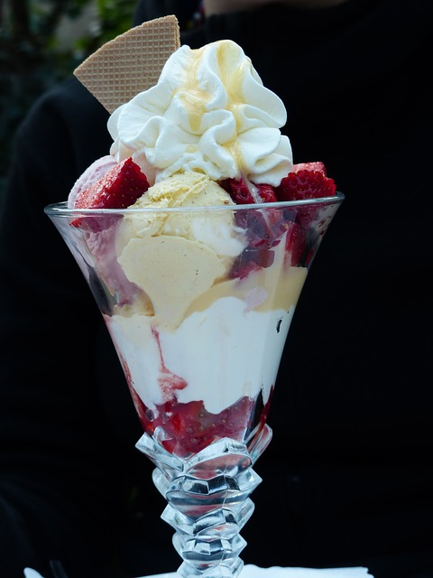
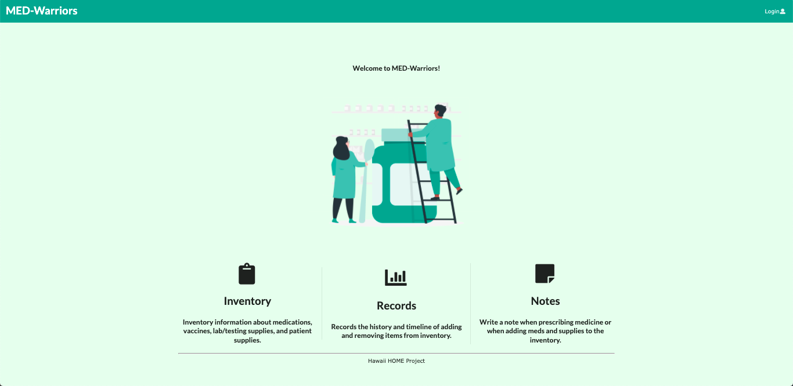

## A Decadent Dessert to Top it All Off

Coming back to a restaurant and enjoying a full-course meal for the second time is what I felt about taking ICS 414.  If you are new to reading my essays, here is a [link](https://duhkneelow.github.io/essays/final-essay.html) of my reflection from ICS 314 to show you what I am saying.  To me, ICS 414 had familiar content as most of them were covered in ICS 314.  The only difference is ICS 314 was more of the appetizer and entree, and ICS 414 is the decadent dessert to top it all off.  Eventually, ICS 414 became one of the most intense yet worthwhile classes I took because it has strengthened my software developing skills just like how dessert can enhance a customer's experience.

## Doctoring Up Sweet Success
The client we had was the [Hawaii Homeless and Medical Outreach Project (H.O.M.E)](https://sites.google.com/view/hawaiihomeproject/about?authuser=0), and their main objective was to develop an inventory application for their medications and supplies.  The H.O.M.E Project is a mobile clinic where they see 2-10 patients per half-day at certain places around the island.  During the first three milestones of the project, I was more focused on the graphics of the application as I have a graphic design background.  However, I believe I was making the least amount of progress.  So, after the third milestone, I thought it was time where I got out of my comfort zone and at least helped my group with any functionality to satisfy our clients.  Eventually, we finished our roles as if we were the doctors of code developing an application for them, resulting in sweet success.

## Less is More with Parameters

Although my team and I were able to successfully create a user-friendly application, there were some moments where I encountered a brain freeze.  The first setback was the MATRP template because I was unfamiliar with it when I took ICS 314.  However, it was beneficial as it enhanced our code, indicating a way to follow coding standards.  The other and most important setback I had was overcomplicating our API data as I added unnecessary parameters to our collection, which caused a few discrepancies.  To me, that is a valuable lesson I will take after this class because sometimes you do not need to put a lot of parameters for a certain collection, which is similar to putting too many toppings on an ice cream sundae where certain toppings can overwhelm your sundae.

## Thirds?  Fourths?  Maybe Fifths
Overall, I am happy with the application we developed as a group, and I wish we continued with our progress as I believe we have more ways to satisfy the clients.  However, I hope I do not make the same mistakes again because I might need the doctor if I overwhelm myself.  If I plan to make more applications with a similar template to the one we used this semester, it would be like me going back to the restaurant for the umpteenth time.  To me, I would be OK with it because at least I would be aware what the format looks like and I would be satisfied with the results I will make.  With the tools and tricks we have implemented, I feel ICS 414 has given me a look to what the path of software engineering is.

## Learn More About our Application
- To learn more about our application, please click on this [link](https://med-warriors.github.io) as it has directions where you can run our project locally.
- To view our source code, please refer to this [link](https://github.com/med-warriors/project).
- To view our deployed application, please refer to this [link](https://medwarriors.meteorapp.com/#/).
