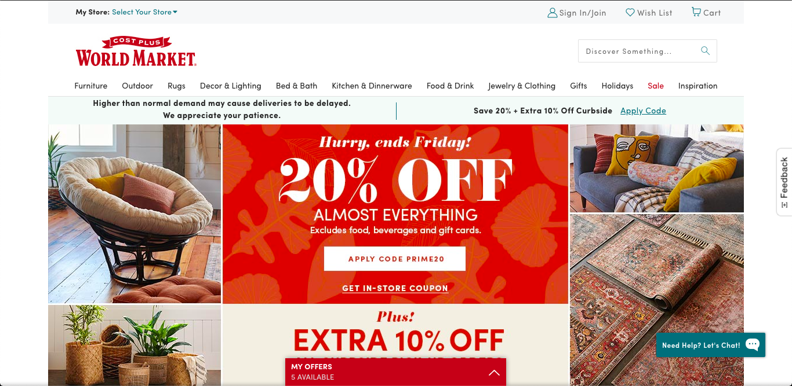
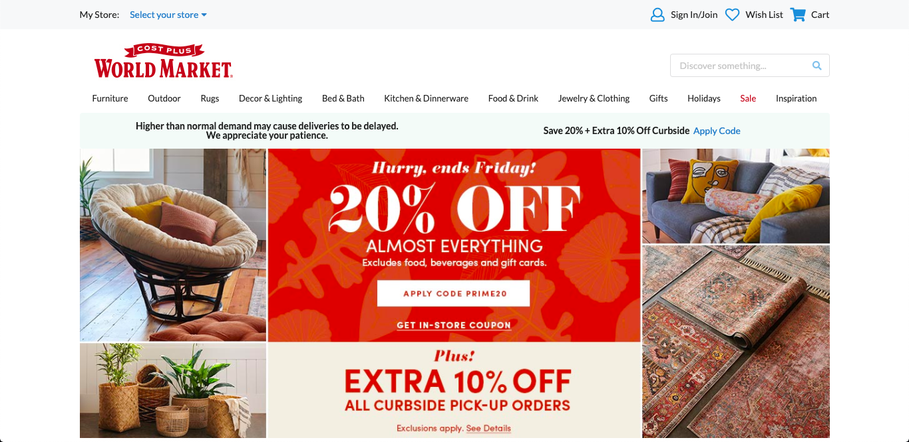

Throughout my lifespan, you can say I have trekked a bunch of websites and yet I have managed to think to myself how to implement the menu bar, adjust the columns of images and other components of a webpage.  Although I actually have had previous experience with HTML and CSS from previous class and job experiences, it actually dawned on me a few weeks ago when I attended a bWOD conducted by our awesome teaching assistant Branden where I practiced implementing code purely of HTML and CSS.  When I was attempting to replicate the images provided in the bWOD, I kept scratching my head in confusion and was wondering to myself, "Why is it not responsive?  Why is the sidebar overlapping the main area of the website?".  Fortunately enough, I was actually doing mostly everything right all along as it is difficult to create a functionally responsive webpage with only HTML and CSS.

## Behold, Mt. Semantic UI

For those of you who have not had experience with [Semantic UI](https://semantic-ui.com/kitchen-sink.html), it is basically a framework designed for you to create astonishing responsive layouts utilizing HTML and CSS.  From the variations of buttons to the content of items, the possibilities of making an awe-inspiring website for the user are definitely endless.  Just like how a mountain has jagged rocks and freakishly narrow crevices, there are certain obstacles on creating/replicating webpages with Semantic UI.  After experimenting with the elements/collections/views of the article, I was pretty impressed with the code I created when I was doing the exercises throughout the week.

## Nowhere But Up
**Original Website (top portion)**

On the Semantic UI exercise, we had the choice to select a website we chose to replicate and I picked the retail store [World Market](https://www.worldmarket.com/).  When I was working on it, I thought we were supposed to copy every single component.  However, when I realized we did not have to do every component, I was a bit dejected at first since I devoted a lot of time finishing that assignment.  At the same time, I was grateful that it happened since it necessarily challenged me to think of paths on how to accurately copy a specific component.

Observing the original website, I immediately noticed there were a lot of linked images that clicked to a bunch of pages on the website.  When i inspected the image, I was fortunate it was only one image because I initially thought I had to go to PhotoShop or a photo editing software to emulate the images.  In order to incorporate Semantic UI, all I had to do was
```
<a class="ui fluid image">
  
</a>
```
just for one image.  As you can see, there are certain ways of properly approaching Semantic UI just like how there are shortcuts to grueling trails when you climb up a mountain.  With motivation and a lot of patience, you would feel like you have reached the top similar to my image of the recreated website below.
**Recreated Website (top portion)**


## Conclusion
At the end of the day, it does not matter what background you have, Semantic UI is user-friendly for any person intrigued with software engineering.  Despite it being overwhelming for some people, just keep practicing until you feel comfortable with Semantic UI.  Do not get defeated with what you have right now.  With the right tools and a positive mindset, you will reach that software summit because someday a user may like a webpage you created with that layout.
