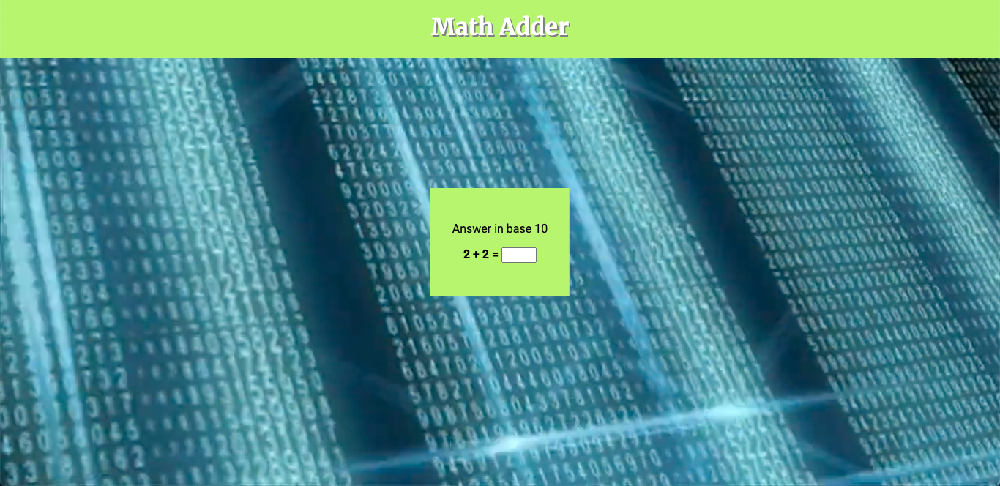

Are you wondering how you can improve with your adding skills?  Come and practice them with the Math Adder I created during my internet programming class at Hawaii Pacific University.  It helps practice your adding in hex/base 10 while thinking quickly since it is timed.  Looking back at it, I definitely need to work on my hexadecimal addition since it seems I forgot how to do it, but it was an overall fun project to do.
Here is the [link](http://daniel18.stem.ninja/math/math.html) for some practice. 
For more fun, here is [another version](http://daniel18.stem.ninja/php/adder.php) of it if you want to really challenge yourself!
