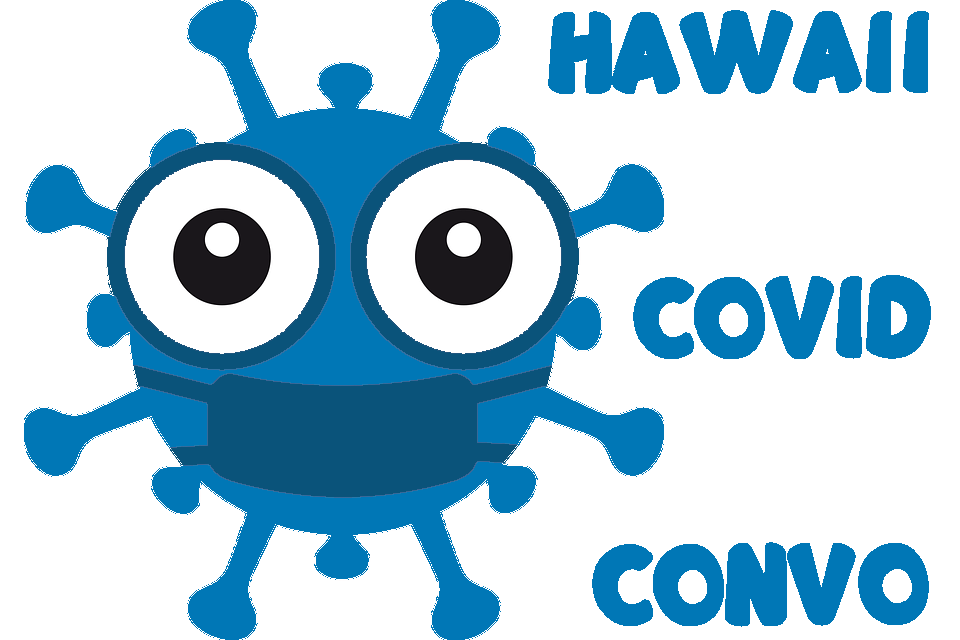
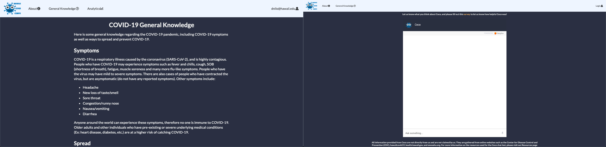
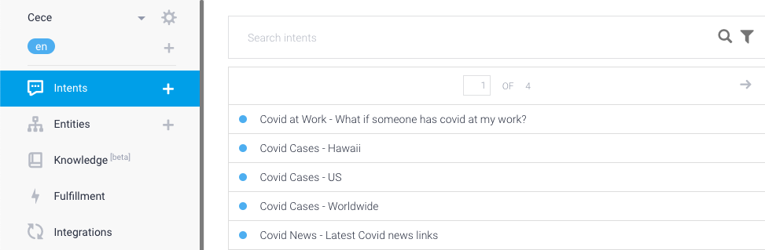

As this being my first semester at UH Manoa and ever since I took a gap year, ICS 314 definitely challenged me on how much I have grasped from the coding exercises throughout the semester.  Albeit intense, the class overall was nothing but non-stop fun as I enjoyed developing applications, including the final project.  For the final project, my group and I decided to create [Hawaii Covid Convo](https://cece-convo.xyz/#/), an application where users interact with our Chatbot, Cece (our nickname for Covid Convo), and discuss questions they have in regards to the state of Hawaii and other questions associated with the COVID-19 pandemic.  Cece responds to more than 50 questions and to know the questions, please refer to our [application](https://hi-covid-convo.github.io/)!

## Major Project Contributions
### Application UI and Responsiveness

Since the header of the Chatbot iframe had a dark-colored header, I inspected it with a color picker to appropriately blend in with the Chatbot page.  As a result, I believe the dark gray color seamlessly integrated our application (with the exception of the landing page as the image was shot by the spectacular Sydney Dempsey) to indicate the dark times we are currently experiencing with the pandemic, but eventually seeing the light at the end of the tunnel.  Throughout the project, I dabbled on the responsiveness of our application to ensure it is suitable for any electronic device.  I also handled any front-end development errors to make sure all our links worked and make our overall application as error free as possible.

### Logo

I also created the logo and played around with the word placement of our application name for the logo to symbolize what our project is about.

### DialogFlow Intents and Phrases

One major contribution my teammates and I did for the final project was implementing/researching [Google DialogFlow](https://cloud.google.com/dialogflow), which was our foundation of the application.  With DialogFlow, I helped out with a portion of the intents in order to give a variety of questions for our Chatbot.  I also helped out with creating training phrases and testing them out to see if they respond with their respective intents.

## Project Outcomes
With time management and a well-organized, communicative group, I believe this was a huge accomplishment for my group and me as we all made some forms of substantial progress.  From development issues to testing situations, we all had the capability to solve the obstacles we had from our assignments.  Overall, I absolutely enjoyed working on this final project with my group and I hope I can apply some of the techniques we have learned outside of UH Manoa. 

To view our organization code, please refer to this [link](https://github.com/hi-covid-convo/hi-covid-convo).
