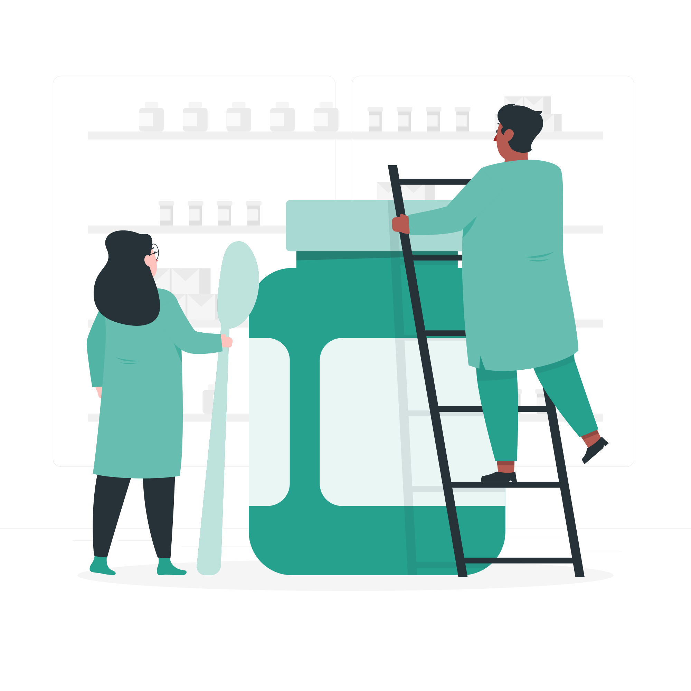
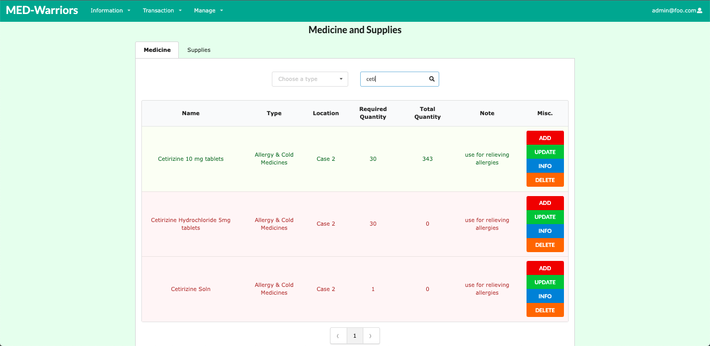
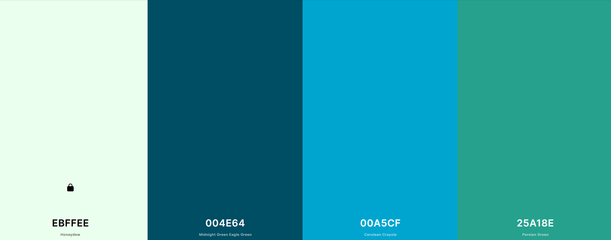
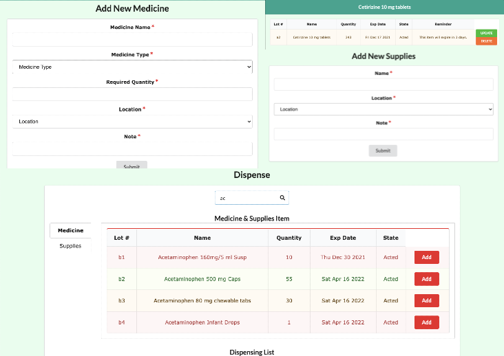

Med Warriors is an online application targeted for the students and faculty of the John A. Burns School of Medicine at the University of Hawaii at Manoa.  My team and I created this application as an efficient and convenient way to log and track information for their medicine and supply inventory instead of using a different chart or form that could have discrepancies.  With possibly more medicine and supplies, we hope this application can ease their method of tracking inventory.

## Major Project Contributions
### Medicine and Supplies Page

The most important contribution I made for this application was the Medicine and Supplies page where I dabbled with the search bar, medicine category dropdown, and pagination to make our application user-friendly.  I also handled the highlight of each medicine and supply from their respected tables for the user to see which item is low or needs refilling based on the ratio of its total and required quantity.

### Color Scheme

My group and I came up with a monochromatic color scheme to focus on legibility and show we are the University of Hawaii Warriors.

### Other Functionalities

Some other functionalities I helped and implemented with my group include:
- Highlighting the dispense page where the user sees the status of medicine and supply based on the overall quantity
- Working on add medicine and supply forms for functionality and responsiveness
- Adding reminder for medicine in the info button displaying when it will expire

## Project Reflection
One of the setbacks I had before starting ICS 414 was the MATRP format as I was not familiar with it when I took ICS 314 last year.  Despite the learning curve, I believe I made substantial progress for this project as I learned to familiarize the application from time to time and effectively communicated with my group whenever one of us needed help.  This project has to be the best experience I have in terms of teamwork and progress as we had a fun challenge while working on the application.  I also learned I can do more than front-end coding as long as I put in the time and effort to properly create a stunning application for our clients.  Overall, I am satisfied with our performance and I hope to create more applications as time goes by!

## Learn More About our Application
To learn more about our application, please click on this [link](https://med-warriors.github.io) as it has directions where you can run our project locally.
To view our source code, please refer to this [link](https://github.com/med-warriors/project).
To view our deployed application, please refer to this [link](https://medwarriors.meteorapp.com/#/).
