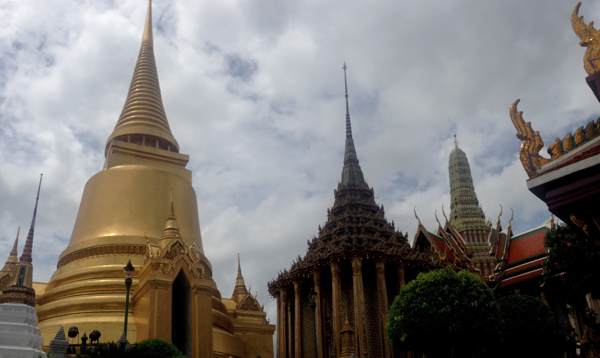
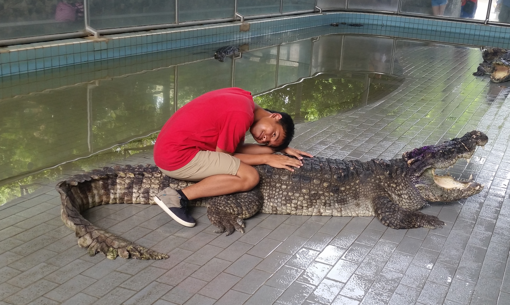

I know that there people that miss traveling to different places they have never been to and experiencing that culture shock since we are going through these difficult times of the coronavirus pandemic.  So to hopfeully combat that, I decided to go through the pictures of my e-mail and found a picture I took of the Grand Palace in Bangkok, Thailand.  Although the first and last time I went there was back in 2014 during my 17th birthday and the fact it can be humid over there, I genuinely want to go back there so badly when the pandemic is over so that I can go to as many temples/wats as I can and eat more their delicious food since I consider that my happy place.  I am also hoping to travel as many places as I can throughout my life so I can expand my horizons and be culturally aware of where they come from.  Hopefully this page motivates you enough to eventually travel whenever the pandemic is over.  If not, close your eyes and picture yourself being at your #1 destination right now enjoying whatever environment you're in!

Meanwhile, please enjoy this image of me sitting on top of a crocodile!  And yes, it also happened in Thailand.

